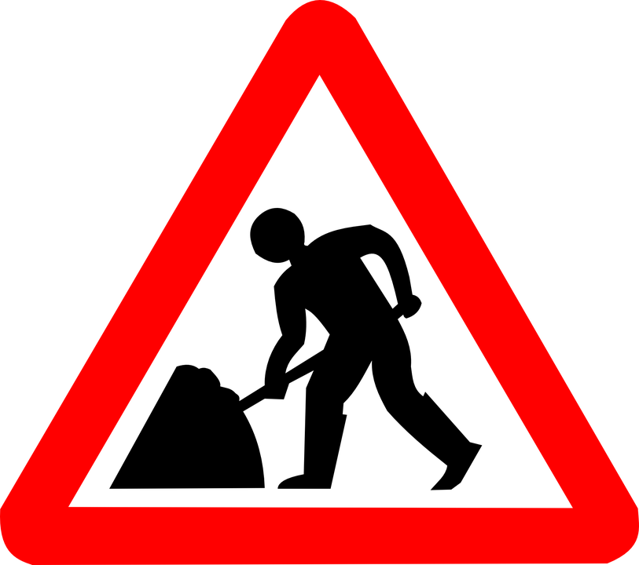
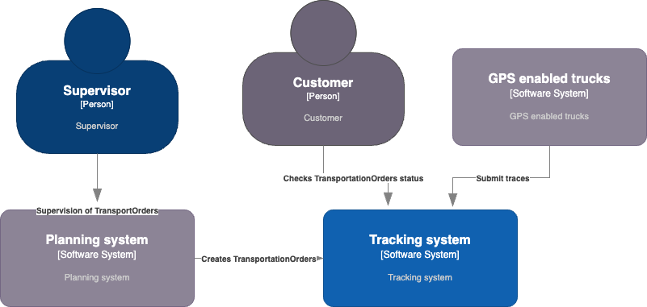

# Arquitecture 

Once a review of the Logistics case study domain model has been done, it is time to think about architectural and detailed design: which pieces and components will be developed with the current technology. We will rely on the application of Domain Driven Design and use C4 diagrams for documentation.

## Tracking system context diagram

The C4.1 context diagram is as follows: the tracking system gets Transportation Orders -these are received by each truck, and traces are sent by GPS devices onboard. The tracking system main goal is keeping the status of each TransportationOrder updated so users get to know the actual position of each truck, its status (onRoad, arrived), and the expected time of arrival (ETA).

